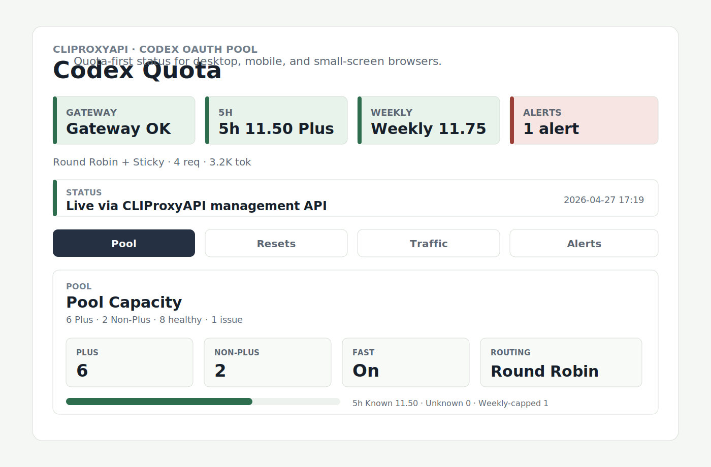

# Codex Quota Monitor

[简体中文](README.zh-CN.md)

Browser-friendly quota and pool dashboard for `CLIProxyAPI`-backed Codex OAuth pools. It gives a fast read of remaining Plus capacity, current traffic split, and only the alerts that actually require intervention. The layout is tuned for desktop browsers, phone screens, and small e-ink browsers.



## At A Glance

- `Pool`: 5h and weekly known Plus capacity, compact account cards, and Team visibility without counting Team plans into Plus totals
- `Traffic`: current request, success, token, and account split from `CLIProxyAPI` usage
- `Alerts`: only hard auth failures, explicit quota exhaustion, and monitor/source degradation
- `Target devices`: desktop, mobile, and small-screen browsers

## Quick Links

- Humans: [Quick start](docs/quick-start.md)
- Agents: [Deploy with an agent](docs/deploy-with-agent.md)
- NixOS operators: [NixOS module](docs/nixos-module.md)

## Quick Start

### Run With Nix

```bash
nix run .#codex-quota-monitor -- \
  --management-base-url http://127.0.0.1:8318 \
  --gateway-health-url http://127.0.0.1:8317/healthz \
  --auth-dir /path/to/auth-files
```

The default bind is `127.0.0.1:4515`. If you want phone or e-ink access on the local network, pass `--host 0.0.0.0` and expose the port intentionally.

### Run With Python

```bash
python -m venv .venv
. .venv/bin/activate
pip install -e .
codex-quota-monitor \
  --management-base-url http://127.0.0.1:8318 \
  --gateway-health-url http://127.0.0.1:8317/healthz \
  --auth-dir /path/to/auth-files
```

Then open `http://127.0.0.1:4515/`.

## What The Monitor Needs

- A reachable `CLIProxyAPI` management gateway, usually something like `http://127.0.0.1:8318`
- A reachable gateway health endpoint, usually something like `http://127.0.0.1:8317/healthz`
- Optional direct Codex auth files if you want 5h and weekly quota sampling instead of pool-only visibility

## For Agents

If you want Codex, Claude, or another agent to wire this into an existing NixOS host, start with [Deploy with an agent](docs/deploy-with-agent.md). That doc is written so a user can hand it to an agent as-is, with minimal extra interpretation.

## Validation

```bash
python -m unittest discover -s tests -v
nix build .#codex-quota-monitor
nix run .#codex-quota-monitor -- --help
```
